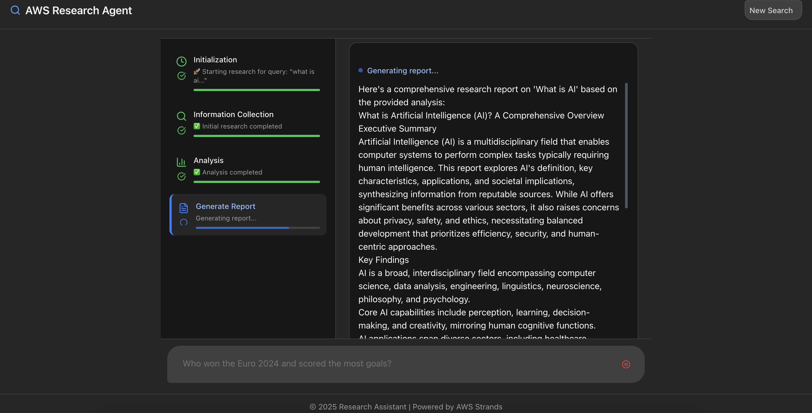
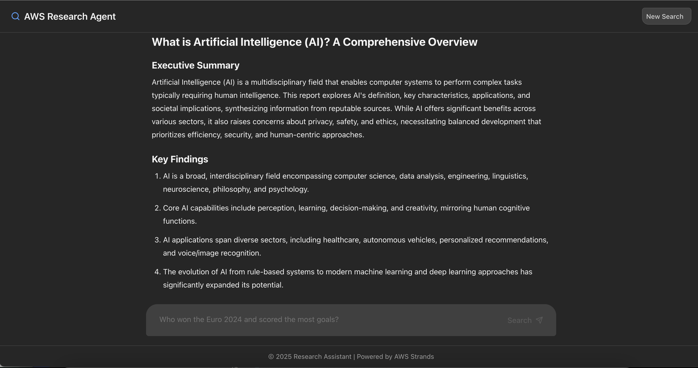
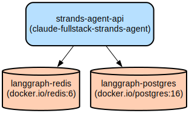

# AI-Powered Research Assistant with Multi-Agent Architecture

A full-stack web application that conducts comprehensive research using multiple specialized AI agents to gather, analyze, and synthesize information from diverse sources into coherent reports.

This application combines a React-based frontend with a Python backend to provide an intelligent research assistant powered by AWS Bedrock. The system employs a multi-agent architecture with specialized agents for research, analysis, and report writing. It features real-time progress tracking, adaptive search strategies, and streaming report generation.

The application supports configurable research depth, multiple search engines, and generates comprehensive reports with source citations. It includes features like language detection, search summaries preservation, and a responsive UI that provides clear visibility into the research process.





## Repository Structure

```
.
├── backend/                      # Python backend application
│   ├── src/agent/              # Core agent implementation
│   │   ├── tools/             # Specialized agent tools (search, language, research)
│   │   └── utils/            # Utility functions and language detection
│   └── run_backend.[sh|bat]   # Platform-specific backend startup scripts
├── frontend/                    # React frontend application
│   ├── src/                   # Frontend source code
│   │   ├── components/       # React components including UI elements
│   │   ├── hooks/           # Custom React hooks for research agent
│   │   └── lib/             # Utility functions and helpers
│   └── public/              # Static assets
├── docs/                       # Documentation and infrastructure diagrams
└── Dockerfile                  # Multi-stage build for containerization
```

## Usage Instructions

### Prerequisites

- Python 3.11 or higher
- Node.js 20.x or higher
- AWS account with Bedrock access
- AWS credentials configured
- Docker (optional, for containerized deployment)

### Installation

#### Backend Setup

```bash
# Clone the repository
git clone <repository-url>
cd <repository-name>

# macOS/Linux
cd backend
./run_backend.sh

# Windows
cd backend
run_backend.bat
```

#### Frontend Setup

```bash
cd frontend
npm install
npm run dev
```

#### Docker Setup

```bash
docker build -t research-assistant .
docker run -p 8000:8000 research-assistant
```

### Quick Start

1. Access the application at `http://localhost:3000`
2. Enter your research query in the input field
3. Select research effort level (low/medium/high)
4. Choose search engine preference
5. Submit and monitor research progress

### Troubleshooting

#### Common Issues

1. Backend Connection Failed

```bash
# Check if backend is running
curl http://localhost:8001/health

# Verify environment variables
cat backend/.env
```

2. Search Results Not Appearing

- Verify AWS credentials are configured
- Check Tavily API key if using Tavily search
- Review backend logs for search errors

3. Frontend Development Server Issues

```bash
# Clear npm cache
npm cache clean --force
npm install
```

## Data Flow

The application implements a multi-stage research process with specialized agents handling different aspects of information gathering and processing.

```ascii
[User Input] -> [Research Agent]
                     |
                     v
[Web Search] <-> [Data Collection]
                     |
                     v
[Analysis Agent] -> [Verification]
                     |
                     v
[Writer Agent] -> [Final Report]
```

Key Component Interactions:

1. Research Agent initiates web searches and collects raw data
2. Analysis Agent verifies and synthesizes collected information
3. Writer Agent generates structured reports
4. Frontend streams progress updates and results
5. Backend manages agent coordination and data flow
6. Redis handles caching and state management
7. PostgreSQL stores research history and results

## Infrastructure


The application uses a containerized architecture with the following components:

Lambda Functions:

- strands-agent-api: Main application service handling research requests

Databases:

- langgraph-redis (Redis 6): Caching and session management
- langgraph-postgres (PostgreSQL 16): Persistent storage
